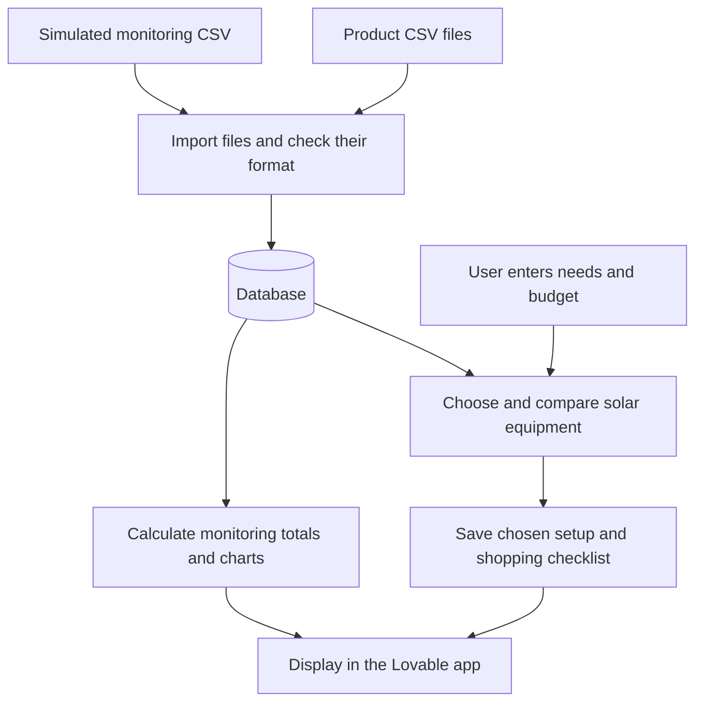
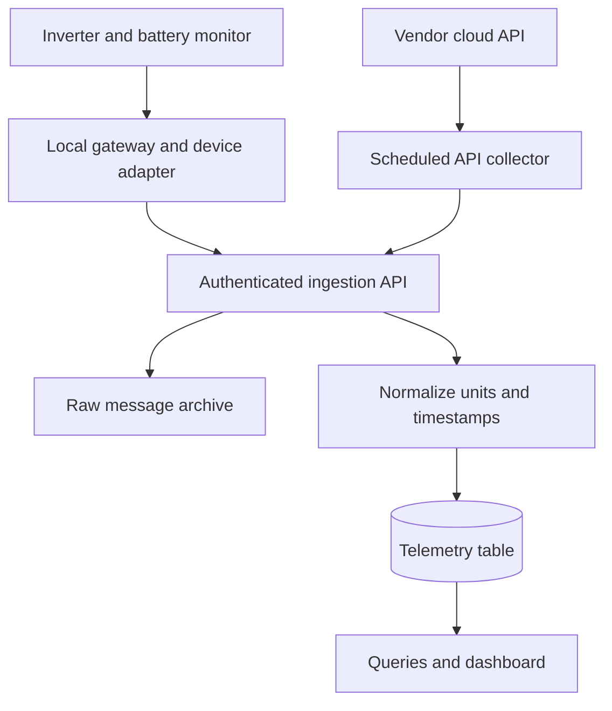

# Solar Builder — Part 2 prototype

Prepared for Aira's Innovation Pioneers hackathon. Scope: one fictional Philippine household, component selection and comparison, shopping checklist, installation handoff and simulated monitoring. Parts 1, 3 and 4 are outside this prototype.

## Start today

1. Open LOVABLE_PROMPT.md and paste its contents into Lovable.
2. Attach demo_seed.json as the consolidated seed data. If preferred, supply the CSV files instead; each JSON key matches one CSV/table name. These are alternative import routes, not two datasets to append together.
3. Ask Lovable to finish the builder, comparison and checklist first; then monitoring. The prompt includes acceptance criteria.
4. Run the demo journey: household profile → Balanced build → compare → choose → checklist → installation handoff → open demo installed system.
5. On monitoring, select September 9, 2026. The data covers September 3–9 inclusive in Asia/Manila. “Today” should mean the selected demo date, not the computer's current date.

All readings, product specifications, suppliers and prices are synthetic. Nothing is copied from an owner's household. Screenshots inspired the kinds of metrics and charts only. No real hardware is required. Data is already standardized; no cleaning exercise is needed.

## Good to know before

Imagine one household with solar panels, an inverter and a battery.

| Equipment                     | Easy explanation of its data                                                                                                                                            |
| ----------------------------- | ----------------------------------------------------------------------------------------------------------------------------------------------------------------------- |
| **Solar panels**              | Produce electricity. Ordinary panels usually do not send data to your app themselves. The **inverter or charge controller measures** the electricity coming from them.  |
| **Inverter**                  | Converts the panels’ electricity into electricity the home can use. It can also report measurements, such as solar power, its temperature and whether it has a problem. |
| **Battery**                   | Stores electricity. A **battery management system (BMS)** or battery monitor provides readings such as battery percentage, temperature and whether it is charging.      |
| **Household/grid meter**      | Measures electricity moving between the house and the electricity grid. Suitable monitoring equipment also helps determine how much electricity the whole home uses.    |
| **Weather sensor or service** | Provides weather information. The solar panels do not automatically tell your app the outdoor temperature or sunshine level.                                            |

For example, your dashboard might display:

Solar producing: 3 kW — measured at the inverter.
Home using: 2 kW — obtained from suitable household monitoring.
Battery: 70% — estimated by the battery monitoring system.

These readings can arrive together through one monitoring connection. You do not necessarily need a separate internet connection for each component.

A few words in that section also need explaining:

| Term                      | What it means                                                                                                   |
| ------------------------- | --------------------------------------------------------------------------------------------------------------- |
| **Solar array**           | A group of solar panels working together.                                                                       |
| **Operational data**      | Readings showing what the installed equipment is doing.                                                         |
| **DC / AC**               | Two forms of electricity. Panels produce DC; the inverter converts it into AC for typical household appliances. |
| **State of charge — SOC** | The battery’s estimated charge percentage, like the percentage on your phone.                                   |
| **Grid import / export**  | Import means taking electricity from the electricity network. Export means sending surplus electricity back.    |
| **Gateway / data logger** | A device that collects readings from equipment and makes them available to software.                            |
| **Vendor API**            | A way your software can request data from the equipment company’s monitoring service.                           |
| **Telemetry**             | Technical shorthand for equipment readings collected over time.                                                 |

**A gateway collects equipment readings, and your backend receives those readings through a supported interface, such as an API. Your database stores them, and your dashboard displays them.**

## What equipment actually supplies

| Equipment | Possible operational data | Where it usually comes from |
|---|---|---|
| Solar array | DC voltage, DC current, DC power; accumulated energy | Inverter or charge controller measuring connected strings. Ordinary panels do not each send internet messages. Panel-level data needs suitable additional electronics. |
| Inverter | PV inputs, AC output, operating status, temperature, fault codes; sometimes combined system flows | Inverter interface, data logger or vendor monitoring API. Available fields vary by device and configuration. |
| Battery | Voltage, current, charge/discharge power, state of charge, temperature; sometimes health/cycles/alarms | Battery management system (BMS), battery monitor or inverter relaying these readings. State of charge is an estimate, not a direct energy measurement. |
| Grid/household meter | Grid import/export and household consumption | Smart meter/current sensors or a supported inverter's measurements/calculations. Whole-home consumption is not guaranteed by owning an inverter. |
| Weather | Outdoor temperature, sunshine/irradiance | Separate weather service or sensor. It is not automatically supplied by panels. |

- IoT means Internet of Things. 
- A gateway is the small computer/logger translating device readings into messages your software understands. 
- A sensor can feed your familiar API workflow; sensor versus API is not an either/or choice.

Real example: Victron's GX gateway provides Modbus-TCP access to connected chargers, battery monitors and inverters. Its documentation explicitly says not every register is available for every device. Therefore the product promise should be “supports documented compatible devices,” not “works with any hardware.” Protocol support alone does not establish electrical or battery/inverter compatibility.

Source: [Victron GX Modbus-TCP manual](https://www.victronenergy.com/live/ccgx:modbustcp_faq), accessed September 10, 2026. This is evidence that third-party monitoring is possible, not a claim that our demo integrates with Victron.

## Architecture for today

For this prototype, we will import our CSV files into a small database. The database stores the information that the app needs for **choosing solar equipment** and **showing how an installed system performs**.

### 1. Keep two types of data

| Data                            | What it contains and why we need it                                                                                                                   |
| ------------------------------- | ----------------------------------------------------------------------------------------------------------------------------------------------------- |
| **Product catalog**             | Solar panels, inverters, batteries, specifications, suppliers and prices. The app uses this information to help users build and compare solar setups. |
| **Monitoring data — telemetry** | Readings such as solar production, household electricity use and battery percentage. The app uses these readings to display charts and summaries.     |

For today, both come from our synthetic CSV files. No real solar equipment is needed.

### 2. Store the data in tables

A **relational database** stores information in tables that can be connected using IDs. For example, a household ID connects a household to its installed solar system.

We will keep product information in separate tables and put the monitoring readings in **one table called `telemetry`**.

Each telemetry row represents **one five-minute period for one installed system**. Its columns contain the different readings for that period:

| Time  | System ID | Solar power | Household usage | Battery charge |
| ----- | --------- | ----------- | --------------- | -------------- |
| 12:00 | SYS001    | …           | …               | …              |
| 12:05 | SYS001    | …           | …               | …              |
| 12:10 | SYS001    | …           | …               | …              |

This is what **“one wide telemetry table”** means: several types of readings stored together in the same row.

Product prices and specifications stay in the product tables. We do not copy them into every five-minute reading.

We do not need a **star schema**, which is a particular way of organising tables for analysis. These simpler connected tables are enough for our one-household prototype.

### 3. Use the database for two app features

* **Solar Builder:** Uses the household’s needs, budget and product catalog to help the user choose equipment, compare setups and save a shopping checklist.
* **Monitoring dashboard:** Uses telemetry to show solar production, electricity use and battery charge over time.

### How to read this diagram

This diagram shows how our CSV data becomes useful information in the Solar Builder app.

**1. Start with two groups of CSV files**

* **Product CSV files** contain solar panels, inverters, batteries, prices and suppliers.
* **Simulated monitoring CSV** This is the **telemetry.csv** that contains example readings showing solar production, household electricity use and battery charge every five minutes.

**2. Import the files into the database**

We check that the files have the required columns and correctly formatted values, then load them into the database. The data is already cleaned.

**3. The app uses the data in two ways**

| Solar equipment selection                                                      | Solar monitoring                                                                       |
| ------------------------------------------------------------------------------ | -------------------------------------------------------------------------------------- |
| The user enters their electricity needs and budget.                            | The app reads the simulated monitoring data.                                           |
| The app uses the product catalog to help them choose and compare solar setups. | It calculates summaries, such as how much solar electricity was produced during a day. |
| The chosen setup is saved with a shopping checklist.                           | The results are presented as numbers and charts.                                       |

**4. Display the results in the Lovable app**

The user can view their selected equipment and shopping checklist, or open the monitoring dashboard.

For this prototype, monitoring shows **simulated readings from one fixed demo installation**. Choosing a different shopping setup does not change those historical readings.

| Table/file | One row represents | Key and relationships |
|---|---|---|
| households | One household's planning inputs | household_id |
| panels | One fictional panel model | panel_id |
| inverters | One fictional inverter model | inverter_id |
| batteries | One fictional battery model | battery_id |
| suppliers | One fictional supplier | supplier_id |
| listings | One supplier's offer for a component | listing_id; supplier_id; component_type + component_id identifies the appropriate catalog table |
| configurations | One proposed build | configuration_id; household_id and three component IDs |
| installed_systems | One monitored installation | system_id; household_id; configuration_id |
| telemetry | One installation's five-minute interval | composite key (system_id, timestamp_utc) |
| daily_summary | One local day's energy totals | (system_id, date_local); derived from telemetry |

The application can additionally store checklist state keyed by configuration_id and item key. Listings use a simple polymorphic reference for this demo: validate component_type and component_id together in application code. A future production database could use a shared components table with foreign keys. Configurations here assume one model of each component, with battery units in parallel; this is an intentionally small model, not a universal BOM schema.

The daily CSV is a convenience for the complete history. During replay, recompute summaries using only intervals already revealed. Do not add daily summary values to telemetry totals: they represent the same energy.

## Later, when you build the ingestion yourself

These are alternative acquisition paths. Start with one supported device, or use a script to replay this CSV as JSON into FastAPI. The local adapter reads the manufacturer's documented registers/API; the cloud collector uses authorized API access. MQTT is an optional transport, not a requirement for IoT. No Kafka, Airflow, lakehouse or streaming cluster is needed for one household.

Practical future steps:

1. Define the reading contract using the telemetry columns below.
2. Build a Python replay script that reads one CSV row and POSTs it to your FastAPI endpoint.
3. Validate its system ID, timestamp, numeric fields and units. Use an upsert on (system_id, timestamp_utc) so retries do not duplicate energy.
4. Store in PostgreSQL; query latest readings and aggregate by the household's local day.
5. Replace the replay script with a documented device adapter after you have physical hardware access.
6. Preserve original device messages and source metadata in the real pipeline. Handle unavailable values as null with a quality flag, never a fabricated zero. Add authentication, per-household access, buffering and retry handling before connecting real homes. Credentials belong on the server/gateway.

You can later use your familiar FastAPI + PostgreSQL stack for these responsibilities. Lovable owns the app implementation for today's demo.

## Data dictionary and calculation contract

CSV headers are snake_case; decimal separator is a dot; encoding UTF-8. All telemetry numeric fields are required and populated in this synthetic dataset.

| Telemetry field | Type/unit | Meaning |
|---|---|---|
| system_id | text | SYS001, linked to installed_systems |
| timestamp_utc | ISO 8601 UTC | Start of interval; canonical storage timestamp |
| timestamp_local | ISO 8601 with +08:00 | Same instant, shown for ease of understanding |
| interval_minutes | integer | 5 for every row |
| solar_dc_power_kw | kW | Average PV output before modeled conversion loss |
| solar_bus_power_kw | kW | Average solar power at a common modeled AC-equivalent bus, DC × 0.96 |
| load_power_kw | kW | Average power used by the household |
| battery_charge_bus_kw | kW | Average bus power sent into battery conversion/storage |
| battery_discharge_bus_kw | kW | Average power delivered from battery to bus |
| grid_import_kw | kW | Average power bought from grid |
| grid_export_kw | kW | Average surplus delivered to grid in this fictional scenario |
| battery_soc_start_pct | % | Estimated stored energy percentage at interval start |
| battery_soc_end_pct | % | Estimated stored energy percentage at interval end |
| battery_temperature_c | °C | Synthetic battery temperature |
| inverter_temperature_c | °C | Synthetic inverter temperature |
| grid_status | enum | connected throughout this dataset |
| data_source | enum | synthetic |
| quality_status | enum | valid |

Catalog fields include their units in the headers: _w watts; _kw kilowatts; _kwh kilowatt-hours; _v volts; _a amperes; _php Philippine pesos. Vmp/Imp are voltage/current at maximum power; Voc is open-circuit voltage; Isc is short-circuit current. MPPT is the inverter's solar-input tracking function. bms_family is a fictional allowlist identifier, not a real manufacturer's protocol certification. Other cost allowance is an illustrative combined allowance for additional equipment and installation, not an itemized quote. Tariff, peak sun hours and performance ratio are editable demo assumptions, not sourced Philippine rates or forecasts.

Power is the rate of electricity flow; energy is the amount over time. A 1 kW average over five minutes equals 1 × 5/60 = 0.083333 kWh. Each row contains interval-average power, not an instantaneous sensor sample.

For each power series: interval energy = power_kw × interval_minutes / 60. Sum interval energy for the selected local day. Convert kW to W only for display by multiplying by 1,000. Do not sum kW and label the result kWh.

Common-bus power balance:

solar_bus_power_kw + battery_discharge_bus_kw + grid_import_kw = load_power_kw + battery_charge_bus_kw + grid_export_kw.

Battery stored-energy change = (charge_bus_kw × 0.95 − discharge_bus_kw / 0.95) × 5/60. Battery capacity is 10.24 kWh; SOC is limited to 20–95%. Initial SOC is 65%. Solar DC conversion is 96%. These are simplified simulation assumptions; battery charge/discharge values are not battery-terminal DC power.

The simulator uses solar to serve load first, charges from surplus, exports remaining surplus, discharges for deficits down to reserve, then imports. It has no grid charging, outages, missing intervals or hardware faults. Initial stored battery energy is assumed solar-origin before the observation period. Export is simulated, with no export revenue calculation or claim of utility approval. Replay is historical simulation, not live sensor monitoring.

## Builder logic

Seed builds use the lowest available offer for each component, with enough stock. For each build, total = panel quantity × panel offer + inverter offer + battery quantity × battery offer + other_cost_allowance_php.

| Build | PV | Battery | Illustrative total |
|---|---:|---:|---:|
| Budget | 2.7 kWp | 5.12 kWh | ₱143,000 |
| Balanced | 4.4 kWp | 10.24 kWh | ₱227,000 |
| More Solar | 5.5 kWp | 10.24 kWh | ₱245,000 |

Monthly generation planning estimate = PV kWp × peak_sun_hours × performance_ratio × 30. Balanced example: 4.4 × 4.5 × 0.8 × 30 = 475.2 kWh. This is not guaranteed savings: generation and consumption occur at different times. Target PV kWp = (monthly_consumption_kwh / 30) / (peak_sun_hours × performance_ratio). Display the assumptions.

Backup illustration = nominal battery kWh × (0.95 − 0.20) × 0.95 / critical_load_kw. This assumes a battery starting at 95% and a constant critical load, excludes surge and auxiliary losses, and is not guaranteed runtime.

Apply hard demo checks BEFORE ranking: positive integer quantities; PV nameplate <= inverter max PV; string Vmp within MPPT range; string Voc below max DC voltage; parallel string Imp/Isc within inverter limits; used MPPTs <= available; battery operating range inside inverter battery range; matching fictional BMS family; parallel-unit count within limit; required products in stock; total <= budget for budget-qualified recommendations. Do not let a weighted score compensate for a failed check. Never call a simplified pass a certified safe installation. Temperature-corrected voltage, wiring, protection, roof, load surges, commissioning and real approved battery lists require professional review.

For this small seed, all configured arrays use one series string on one MPPT. Manual editing can show why Demo High Voltage 10 fails with either low-voltage inverter. The More Solar build's nominal Voc is close to the DC maximum; display “temperature-adjusted voltage review required,” not a universal compatibility tick.

## Expected versus monitored performance

Only C2/Balanced is linked to SYS001. Changing a shopping build must never relabel SYS001's historical readings as observations from the new build. Any comparison must say the monitoring belongs to the demo installed Balanced system.

For a like-period comparison use selected_day_count × 4.4 × 4.5 × 0.8 against SUM(solar_bus_kwh) for the same full days. Label this a rough planning estimate versus simulated bus yield. Do not compare a month's forecast against seven days of data. Differences cannot diagnose faulty equipment or weather from this dataset alone.

## Files

telemetry.csv has 2,016 readings (7 × 24 × 12). daily_summary.csv has seven local-day rows. demo_seed.json contains all the CSV tables as typed JSON arrays for convenient app seeding. generate.mjs recreates the datasets with Node.js using built-in modules. validation.txt records the completed telemetry checks. LOVABLE_PROMPT.md is the app-building instruction.
